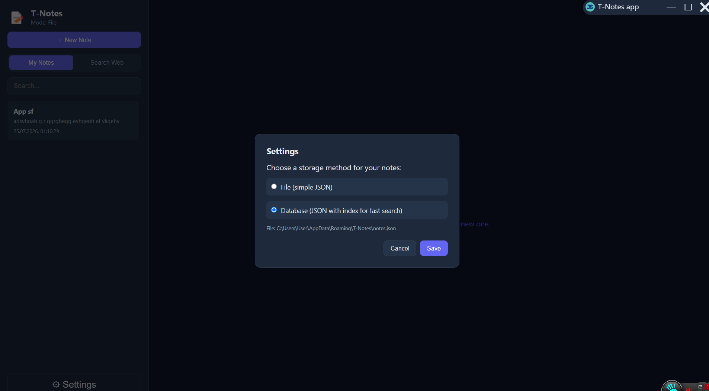
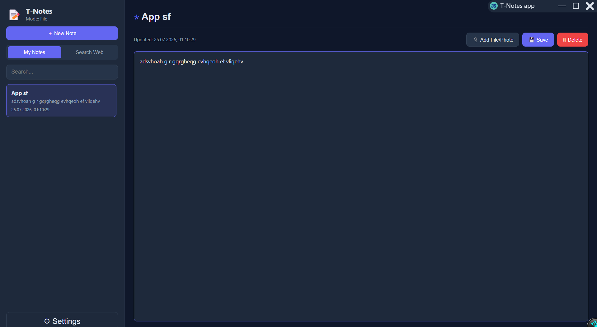
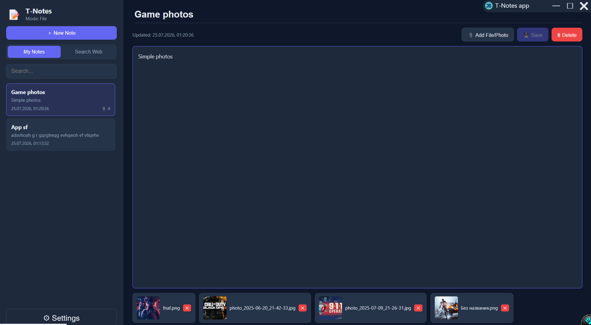
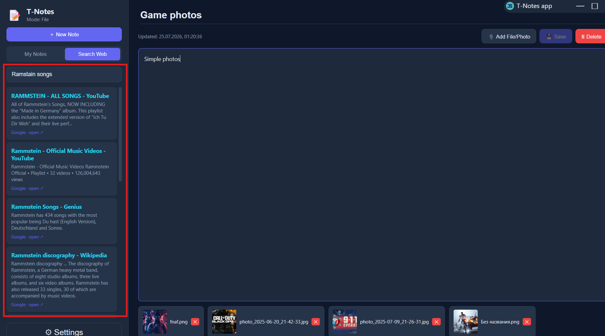
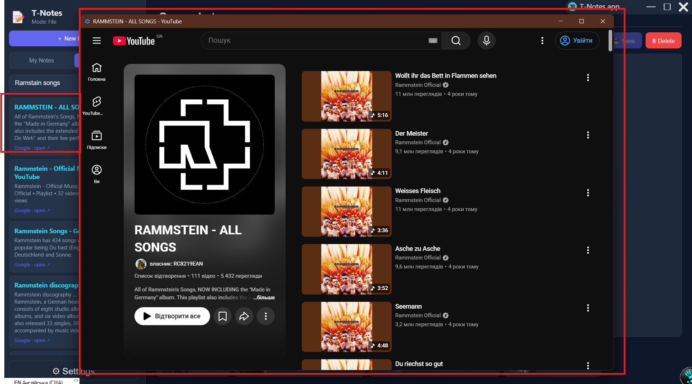

#Notes #App #Browser
## [RU]
##### Это приложение для хранения собственных заметок, вы можете использовать эво для хранения лекарств, списка дел, интересных заметок.
Приложение позволяет сохранять как текст так и фото, видео и другие файлы. Также есть настройки в которых можно выбрать режим хранения данных, их всего два:
- Файловый
- Файловый ускоренный

Файловый ускоренный хранит индексы по которым идет поиск когда вы ищете заметки:

### Встроенный браузер 📺
В приложении присутствует встроенный браузер, вы можете не выходя из приложения найти информацию и сохранить её

При нажатии на результат поиска открывается полноценный веб-сайт

## [EN]
##### This is an app for storing your own notes; you can use it to keep track of medications, to-do lists, and interesting notes.
The app allows you to save text, photos, videos, and other files. There are also settings that let you choose the data storage mode; there are two options:
- File-based
- Accelerated file-based

The accelerated file-based mode stores indices used for searching when you look for notes:

### Built-in Browser 📺
The app features a built-in browser, allowing you to find and save information without leaving the application.

Clicking on a search result opens the full website.

